```mermaid
sequenceDiagram
    participant Agent as Agent (IAQ Orchestrator)
    participant NGSI as MCP-NGSI (read)
    participant STA as MCP-STA (read)
    participant ACT as Actuation-MCP (write)
    participant OPA as OPA Sidecar
    participant OTEL as OTEL Collector
    participant OBS as Grafana / Jaeger

    Agent->>+NGSI: callTool("ngsi_query", { type:"Building" })<br/>scope="ngsi"
    NGSI->>OPA: policy check (capability="read")
    OPA-->>NGSI: allow / deny
    NGSI->>OTEL: emit span mcp.tool.ngsi_query
    NGSI-->>Agent: list of buildings

    Agent->>+STA: callTool("sta_get_observations", { datastream_id:1001 })<br/>scope="sta"
    STA->>OPA: policy check
    STA->>OTEL: emit span mcp.tool.sta_get_observations
    STA-->>Agent: CO₂ observations

    Agent->>Agent: evaluate IAQ policy<br/>(CO₂ > threshold?)

    alt CO₂ > 1000 ppm
        Agent->>+ACT: callTool("bms_setpoint_write", { zone, setpoint, dry_run:true })<br/>scope="bms"
        ACT->>OPA: policy check (capability="write")
        ACT->>OTEL: emit span mcp.tool.bms_setpoint_write
        ACT-->>Agent: ack {status, effect, idempotency_key}
    else No action needed
        Agent-->>Agent: noop
    end

    OTEL-->>OBS: traces + metrics
    OBS-->>Agent: dashboards (Fig. 8)
```

# MAS-MCP City — Agents

This directory contains the **agent layer** of the MAS-MCP City architecture.
Agents coordinate across MCP servers (`mcp-ngsi`, `mcp-sta`, and `actuation-mcp`) using the **Model Context Protocol (MCP)** over WebSocket transport.
They are implemented in Node.js and rely on the same version of the SDK used by the servers (`@modelcontextprotocol/sdk@^1.20.2`).

---

## 1️⃣ Components

| Package            | Purpose                                                          | Key Scopes                         |
| ------------------ | ---------------------------------------------------------------- | ---------------------------------- |
| `mcp-client`       | Generic MCP WebSocket client library for Node.js                 | All (`ngsi`, `sta`, `bms`, `mqtt`) |
| `iaq-orchestrator` | Domain-specific agent for SmartCampus IAQ and occupancy workflow | `ngsi`, `sta`, `bms`               |

---

## 2️⃣ MCP Client Library (`agents/mcp-client`)

### Overview

A thin wrapper around `@modelcontextprotocol/sdk/client/websocket` that:

* Establishes WebSocket connections to MCP servers (`ws://host:port/?token=...`)
* Sends `callTool()` requests with the required **scope metadata**
* Optionally propagates **traceparent** headers for end-to-end observability
* Handles connection lifecycle (`connect()`, `listTools()`, `close()`)

### Example

```ts
import { MCPAgentClient } from "agents-mcp-client"

const ngsi = await MCPAgentClient.connect({
  url: "ws://localhost:8001/?token=dev-token",
  scope: "ngsi"
})

const result = await ngsi.callTool("ngsi_query", { type: "Building" })
console.log(result)
await ngsi.close()
```

---

## 3️⃣ IAQ Orchestrator (`agents/iaq-orchestrator`)

### Purpose

Implements the full SmartCampus IAQ pipeline:

1. Query **NGSI-LD** for contextual entities (buildings, rooms)
2. Retrieve **SensorThings** CO₂ observations
3. Evaluate CO₂ thresholds
4. Optionally trigger **BMS actuation** (dry-run or live mode)

### Workflow

```bash
# Run in local dev environment
AUTH_TOKEN=dev-token \
NGSI_WS=ws://localhost:8001 \
STA_WS=ws://localhost:8002 \
ACT_WS=ws://localhost:8003 \
node dist/cli.js
```

Typical output:

```json
{
  "ok": true,
  "action": "ventilation_boost",
  "building": "urn:ngsi-ld:Building:ES-UA:A1",
  "co2": 1120,
  "ack": {
    "status": "accepted",
    "effect": "planned",
    "idempotency_key": "16987654321"
  }
}
```

---

## 4️⃣ Testing

Both packages include **Vitest** suites.
Run tests locally (requires one server, e.g. `mcp-ngsi`, running on `localhost:8001`):

```bash
pnpm install
pnpm run build
pnpm run test
```

Example test (`agents/mcp-client/test/mcp.test.ts`):

```ts
import { describe, it, expect } from "vitest"
import { MCPAgentClient } from "../src/index.js"

describe("MCPAgentClient", () => {
  it("connects and lists tools", async () => {
    const client = await MCPAgentClient.connect({
      url: "ws://localhost:8001/?token=dev-token",
      scope: "ngsi"
    })
    const tools = await client.listTools()
    expect(Array.isArray(tools)).toBe(true)
    await client.close()
  })
})
```

---

## 5️⃣ Integration with Observability and Policies

* Every agent call includes the correct `metadata.scope` so the server enforces OPA policies and budgets.
* Each tool invocation generates an **OTEL span** (`mcp.tool.<name>`) that appears in Jaeger or Grafana with attributes:

  ```
  mcp.scope, mcp.tool, mcp.decision, mcp.deny_reason
  ```
* The agents can propagate a `traceparent` header for distributed tracing.

---

## 6️⃣ Alignment with FGCS Paper

| Paper Concept                           | Implementation Reference                                   |
| --------------------------------------- | ---------------------------------------------------------- |
| “Agents perform tool-use through MCP”   | All calls use `MCPAgentClient.callTool()`                  |
| “Capability-based policies and budgets” | Metadata scopes (`ngsi`, `sta`, `bms`) enforced by servers |
| “End-to-end observability”              | OTEL spans emitted by `toolWithPolicyOtel(...)`            |
| “Consensus / safe actuation”            | IAQ orchestrator dry-run & idempotent ACKs                 |

---

## 7️⃣ Future Extensions

* Add an **LLM-planning layer** using MCP for semantic tool selection.
* Implement **multi-agent dialogues** using MCP envelopes and the `propose`/`agree` speech-acts defined in the MAS-MCP architecture.
* Extend the CLI to export trace summaries for replication packages.

---

This README ensures reviewers and developers can quickly understand, run, and extend the agent layer in full alignment with the MAS-MCP City paper and the v1.0 reproducible release.


---


# MAS-MCP City — Agents



---

### 🧭 How to read the diagram
- **Blue arrows** (`callTool`) represent standard MCP calls over WebSocket.  
- **OPA** evaluates each request using the federated policy engine (capability + scope).  
- **OTEL spans** are generated for every call; these reach the **OpenTelemetry Collector** and then appear in **Grafana/Jaeger** dashboards as shown in Fig. 8.  
- The **Agent** makes sequential tool calls: NGSI → STA → (optionally) Actuation.

---

